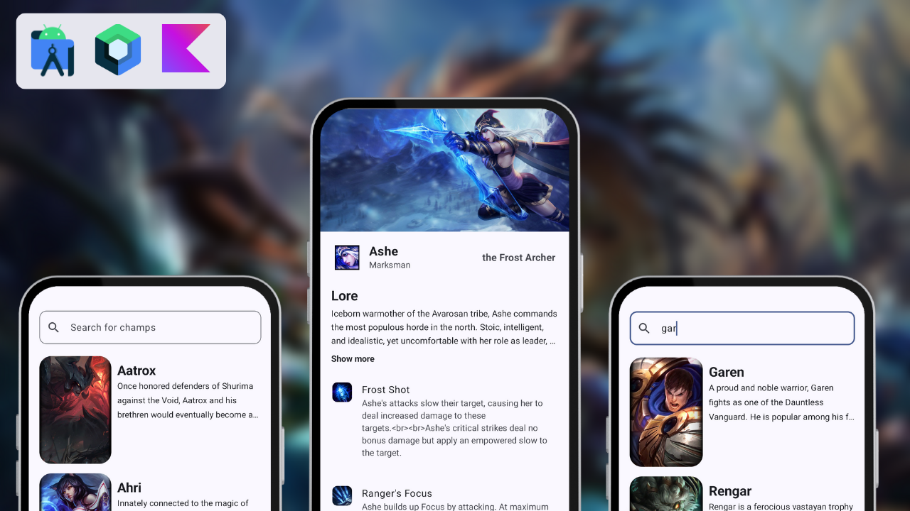

## ✨ LOL-Bookpedia - Clean Architeture using MVVM

  

## 📖 About
I made this project while following a course. I've learned a lot from it, including essential concepts, 
such as:
- Hilt/Dagger (Dependency Injection)
- Coil (Image loading)
- Ktor (API requests)

## 🤗 Acknowledgement
Thanks to [Daniel](https://github.com/daniatitienei) who taught how to create this app in his course about Jetpack Compose.
